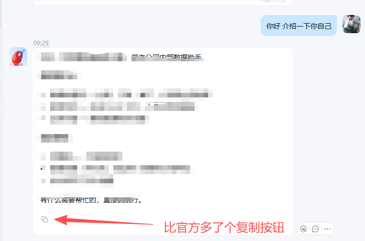

<div align="center">
  
  <h1>dingtalk-openclaw-connector（社区维护版）</h1>
  <p>基于官方 <strong>v0.8.20</strong> 的社区维护版本，由社区持续跟进修复官方无暇处理的 Bug。<br/>
  功能与官方完全一致，拥有最快的修复速度，及时合并官方pr和个人发现的bug和社区急需的 Bug。</p>

  <p><strong>当前发布版：<a href="https://www.npmjs.com/package/@jeik/dingtalk-connector">@jeik/dingtalk-connector</a> v0.8.21-fix30</strong>（稳定生产可用；安装：`npm i -g @jeik/dingtalk-connector@0.8.21-fix30` 或 `@fix`；本地 tgz：`openclaw plugins install ./jeik-dingtalk-connector-0.8.21-fix30.tgz --force`）</p>

  <p>
    <a href="https://www.npmjs.com/package/@jeik/dingtalk-connector"></a>
    <a href="https://www.npmjs.com/package/@jeik/dingtalk-connector"></a>
    <a href="https://github.com/jeikl/dingtalk-openclaw-connector-fix-Community/blob/main/LICENSE"></a>
  </p>

  <p>
    <a href="README.en.md">🇺🇸 English</a> •
    <a href="CHANGELOG.md">更新日志</a> •
    <a href="https://openclaw.ai/">OpenClaw 官网</a>
  </p>
</div>

---

## 🔧 最近更新

| 日期 | 标识 | 更新内容 |
|------|------|---------|
| 2026-07-14 | 🚀 | **v0.8.21-fix30 稳定版**：① 流式串行队列+尾随合并（过程/终态不再半截）；② `answerActToken` 双卡保留；③ OpenClaw 对齐错误中文映射；④ ACK「🦸 正在召唤大模型…」+ 纯工具打头「🤖 大模型已收到需求」；⑤ **安装向导**：accountId 由 clientId 推导（不再写死 apibot）、同 agent 不重复 bindings；⑥ **移除** `cardToolVar`/`cardProcessVar` 配置（工具进度统一写入 `cardContentVar`）；⑦ 仓库清理 |
| 2026-06-29 | 🐛 | **修复答案卡路径触发 500**：`finishAICard` 新增 `skipInputingWalk` 参数；答案卡（`answerCard` 模式）路径是新建的专用模板静态卡，不应走 INPUTING 过渡——内置答案卡模板字段与原流式卡可能不兼容，`streamAICard` INPUTING 切换时钉钉返回 500。答案卡调用时显式传 `skipInputingWalk=true` 直接 PUT FINISHED；message 工具路径仍走 `!inputingStarted` 守卫保留空内容修复。 |
| 2026-06-29 | 🔧 | **答案卡触发阈值默认 600 → 500**：多数中文 LLM 实际回复（500-700 字）跨过原 600 阈值更频繁，改默认值减少"两张卡"体验。已有用户配置不动。 |
| 2026-06-29 | 🐛 | **修复钉钉 AI 卡片流式回复不完整 例 “你...” 的问题** ：采用**延迟建卡**模式，让流式文本积累更多文本，把建卡时机放到真正的文本到来之后，再进行建卡流式卡片展示 |
| 2026-06-29 | 🐛 | **修复 message 工具发卡 content 为空**：`finishAICard` 简化后直接 PUT FINISHED，对 reply-dispatcher 路径（已流式过）无影响，但 message 工具走的「新建卡立刻 finish」路径（`createAICardForTarget` → `finishAICard`，`inputingStarted=false`）会跳过 INPUTING 状态过渡，导致钉钉不渲染 content（卡片空白）。`finishAICard` 现仅在 `!inputingStarted` 时先调一次 `streamAICard(..., /*finished*/ false)` 走完 INPUTING + 内容写入再 FINISHED（`finished=false` 避免触发"假流式回放"，已流式过的路径 `inputingStarted=true` 完全不受影响）。**升级：** `npm install -g @jeik/dingtalk-connector@fix` |
| 2026-06-29 | ✨ | **修复 webchat 中最终答案已生成，但由于钉钉上游流式卡片的原因导致长文本一直渲染的问题**：新增**答案卡模式（默认开启）**，钉钉回复默认会绑定一张流式卡片和答案卡片（默认内置），最终答案如果 token >  `answerActToken`（默认 500）时，原流式卡片直接显示"✅ 思考完成"、另投一张独立的**静态答案卡**，规避钉钉流式卡的官方固定速度渲染的 bug；短答案仍在原流式卡渲染。长文本新建答案卡快速回复，短文本回答不影响用户体验。模板id/阈值可配（`answerCardTemplateId` / `answerActToken`） |
| 2026-06-29 | ✨ | **增加 AI 卡片工具流式展示工具调用进度**：增加调用工具时原卡流式显示 `🔧 正在调用工具：<工具名>`，结束后正常更新为回复 本功能补齐官方连接器未处理 tool 回调的短板|
| 2026-06-29 | 🐛 | **修复多条文本回答、工具调用错误等异常情况导致 AI流式卡片提前停止渲染的问题，**：dws 等工具失败结果（带 `isError`/`isStatusNotice`）以前偶发被当最终答案、提前停渲染；现按 OpenClaw 官方标准排除，但原版官方 dingtalk-connector 并没有考虑这方面，本社区版已完美修复支持，仅展示不计入答案 |
| 2026-06-29 | 🔧 | **安装向导对比官方超级增强**：安装向导支持**增强版AI card、已有配置跳过、扫码配置、填入clientID和clientSecret配置、dws 改为更新最新的 latest 版本、检测并可禁用遮蔽 npm 版的本地插件副本等**，安装向导更健壮 更易懂 更不会覆盖|
| 2026-06-28 | 📦 | **本仓库已上线npm官方仓库包**：`@jeik/dingtalk-connector`，新增一键扫码安装命令；`--force` 覆盖更新无需卸载 |
| 2026-06-28 | 🐛 | 修复模型一轮内发送多条过程消息时，连接器把中间过程消息当成最终答案、提前结束 AI Card 渲染的问题（改为整轮结束才定稿卡片） |
| 2026-05-14 | ✨ | **Markdown 图片发送支持直链和本地路径，无需下载到本地，请参考下列提示词** |
| 2026-05-11 | 🔧 | **Agent 多轮循环完成后，中间过程消息重复发送到钉钉对话，造成刷屏和 AI Card 倒放重渲染** |
| 2026-05-11 | 🐛 | OpenClaw 4.29+ 版本导致钉钉插件失效，群聊 @Agent 回复显示"✅ 任务执行完成（无文本输出）" |
| 2026-05-08 | 🌐 | 未注册的 Pong 监听器导致的 WebSocket 幻影重连，来源于 [PR #566](https://github.com/DingTalk-Real-AI/dingtalk-openclaw-connector/pull/566)（[Majorshi](https://github.com/Majorshi) 提交） |

完整更新日志：[FIXES.md](FIXES.md)（[🇺🇸 English](FIXES.en.md)）

---

## ✨ 增强功能

- 🔧 Markdown 图片发送支持直链和本地路径，无需下载到本地：
  - Markdown 语法 `` 或 `` 直接发送图片
  - 兼容 mediaId 格式
  - ⚠️ 本插件支持图文发送，但钉钉侧不会主动触发此功能，需使用以下提示词引导 Agent：

    ```
    请你把以下发送图片的方式写成你的钉钉图片发送skill，当涉及到图片发送，则调用该技能：用markdown语法发送图片，支持添加图片注释实现图文并茂；直链图片或本地路径文件均可直接嵌入markdown发送，如本地路径含空格请先重命名去除空格再发送。
    ```

- 🎨 支持自定义 AI Card 模板，可使用本人预制的卡片（含内容复制按钮），不填则使用官方默认卡片。

**单机器人：**

```json
"channels": {
  "dingtalk-connector": {
    "enabled": true,
    "clientId": "你的clientId",
    "clientSecret": "你的clientSecret",
    "cardTemplateId": "你的卡片模板ID.schema",
    "cardContentVar": "content"
  }
}
```

**多机器人（多 Agent）：** 每个账号可绑定不同机器人

```json
"channels": {
  "dingtalk-connector": {
    "enabled": true,
    "accounts": {
      "main-bot": {
        "enabled": true,
        "name": "工作流机器人",
        "clientId": "你的clientId",
        "clientSecret": "你的clientSecret",
        "cardTemplateId": "f9b75aac-713c-40e8-a17f-e236d7b5422b.schema",
        "cardContentVar": "content"
      },
      "another-bot": {
        "enabled": true,
        "name": "另一个机器人",
        "clientId": "另一个clientId",
        "clientSecret": "另一个clientSecret",
        "cardTemplateId": "f9b75aac-713c-40e8-a17f-e236d7b5422b.schema",
        "cardContentVar": "content"
      }
    }
  }
}
```

| 参数 | 说明 |
|------|------|
| `clientId` / `clientSecret` | 单机器人模式直接填在顶层 |
| `accounts` | 多机器人模式，key 为账号标识名（可任意命名） |
| `accounts.*.enabled` | 是否启用该账号 |
| `accounts.*.name` | 账号显示名称（仅用于标识） |
| `accounts.*.clientId` | 钉钉应用 ClientId |
| `accounts.*.clientSecret` | 钉钉应用 ClientSecret |
| `cardTemplateId` | AI Card 模板 ID，不填则使用官方默认模板 |
| `cardContentVar` | 卡片内容变量名，不填默认 `msgContent`（过程/工具/终稿统一写入此字段） |
| `answerCard` | 答案卡模式开关，**默认开启**；显式设 `false` 关闭 |
| `answerActToken` | 答案卡触发阈值（token），默认 `500`；最终答案 ≤ 此值直接在原卡定稿，> 此值才另开答案卡 |
| `answerCardTemplateId` | 答案卡模板 ID，不填用内置默认模板（需含 `content` 变量） |

> 卡片模板需在[钉钉开放平台](https://open.dingtalk.com/)创建，并添加对应的变量字段。

---

## 🎯 回复标记 + 答案卡 + 工具进度（核心增强）

这套机制让钉钉侧的「过程 → 最终答案」渲染更干净、更稳定，规避钉钉流式 AI Card 的官方渲染 bug：

- **回复标记**：配合 [prompt-rewriter](https://www.npmjs.com/package/@jeik/prompt-rewriter) 注入的 `[-process-]`（过程段）/`[-final-]`（最终答案）标记。
  - 过程段逐字流式滚动；出现 `[-final-]` 后**停止流式、一次性定稿**（去掉钉钉"假流式回放"）。
  - 标记对用户**完全不可见**（进卡前统一剥离），且**优先级高于** OpenClaw 默认兜底——避免中间过程被误判成最终答案、提前停渲染。
  - 无标记时完全走 OpenClaw 默认逻辑。
- **答案卡模式**（默认开启）：最终答案 token 超过 `answerActToken`（默认 500）时，**原流式卡定格"✅ 思考完成"**，另投一张**静态答案卡**承载完整回复——规避钉钉流式卡 FINISHED 后仍抖动/重渲染的 bug。短答案仍在原卡定稿，不多开卡。
- **工具调用进度**：Agent 调用工具时，原卡流式显示 `🔧 正在调用工具：<工具名>`，工具结束后正常更新为回复。
- **工具失败不再误判**：工具调用失败的结果（带 `isError`/`isStatusNotice`）只在卡片短暂展示，**不会被当成最终答案**。

> 标记功能需安装并启用 prompt-rewriter 插件；答案卡/工具进度为连接器内置，开箱即用。

**效果预览：**



---

## 为什么 Fork？

由于钉钉官方连接器那拉稀的仓库更新与 Bug 修复速度，所以 fork 了此仓库。

本版本在官方代码基础上由社区进行 Bug 修复和维护。**BUG 采用 Claude Code 官方模型修复，保证最大修复效果。**

欢迎民间大神提 PR，共建钉钉连接器生态！

---

## 与官方版本的差异

| 项目 | 说明 |
|------|------|
| 基础版本 | 官方 v0.8.20，功能完全一致 |
| 修复内容 | 官方一直不修的 Bug（见上方最近修复） |
| 维护方式 | 社区维护，持续跟进官方更新 |

---

## 安装与要求

开始之前，请确保：

- **OpenClaw**：已安装并正常运行。详情请访问 [OpenClaw 官网](https://openclaw.ai/)
- **版本要求**：OpenClaw ≥ **2026.4.9**，通过 `openclaw -v` 查看

> 如低于此版本，执行 `npm install -g openclaw` 升级。

---

## 安装

> 与官方插件同 channel id（`dingtalk-connector`），`--force` 直接覆盖更新，**无需先卸载**官方版或旧版。  
> **当前稳定版：`0.8.21-fix30`**（`fix` dist-tag 指向此版本）。安装/更新后**必须** `openclaw gateway restart`。

### 方式一：npm（推荐）

包名：[`@jeik/dingtalk-connector`](https://www.npmjs.com/package/@jeik/dingtalk-connector)

**1）一键扫码安装**（推荐：创建机器人 → 取凭证 → 装插件 → 写配置）：

```bash
# 新装
npx -y @jeik/dingtalk-connector@0.8.21-fix30 install
# 或始终跟 fix 通道
npx -y @jeik/dingtalk-connector@fix install

# 已有 dingtalk-connector / 装不上时强制覆盖
npx -y @jeik/dingtalk-connector@fix --force
```

**2）只装插件**（凭证已配好，或走手动配置文档）：

```bash
# 固定稳定版
openclaw plugins install @jeik/dingtalk-connector@0.8.21-fix30 --force
# 或跟 fix 通道（推荐日常升级）
openclaw plugins install @jeik/dingtalk-connector@fix --force

openclaw gateway restart
```

**3）从旧 fix 升级到 fix30：**

```bash
openclaw plugins install @jeik/dingtalk-connector@0.8.21-fix30 --force
openclaw gateway restart
```

### 方式二：本地 tgz / 源码构建（开发、离线、预发验证）

```bash
git clone https://github.com/jeikl/dingtalk-openclaw-connector-fix-Community.git
cd dingtalk-openclaw-connector-fix-Community
git checkout v0.8.21-fix30   # 可选：钉死发布标签

npm install && npm run build && npm pack
# → jeik-dingtalk-connector-0.8.21-fix30.tgz

openclaw plugins install ./jeik-dingtalk-connector-0.8.21-fix30.tgz --force
openclaw gateway restart
```

> 国内若 clone 慢，可用镜像前缀，例如：  
> `git clone https://ghfast.top/https://github.com/jeikl/dingtalk-openclaw-connector-fix-Community.git`

### 安装后自检

```bash
openclaw -v                    # OpenClaw ≥ 2026.4.9
openclaw plugins list          # 应看到 dingtalk-connector / @jeik/dingtalk-connector
# 发一条钉钉消息：应先出现「🦸 正在召唤大模型…」，再进入流式回复
```

---

## 使用指南

[OpenClaw 钉钉官方插件使用指南](https://alidocs.dingtalk.com/i/nodes/2Amq4vjg89GEno0zfPqoPGqdV3kdP0wQ?utm_scene=team_space)

---

## 进阶文档

- [手动配置指南](docs/DINGTALK_MANUAL_SETUP.md) — 手动填写凭证配置
- [钉钉 DEAP Agent 集成](docs/DEAP_AGENT_GUIDE.md) — 本地设备操作能力
- [多 Agent 路由配置](docs/MULTI_AGENT_SETUP.md) — 多机器人绑定不同 Agent
- [常见问题](docs/TROUBLESHOOTING.md) — 安装与使用问题排查
- [官方 README（中文）](README_DINGTALK_OFFICIAL.md)
- [Official README（English）](README_DINGTALK_OFFICIAL_en.md)

---

## 贡献

欢迎社区贡献！Bug 修复或功能建议，请提交 [Issue](https://github.com/jeikl/dingtalk-openclaw-connector-fix-Community/issues) 或 Pull Request。

---

## 许可证

本项目基于 [MIT](LICENSE) 许可证。

---

## 支持

- **问题反馈**：[GitHub Issues](https://github.com/jeikl/dingtalk-openclaw-connector-fix-Community/issues)
- **更新日志**：[CHANGELOG.md](CHANGELOG.md)
